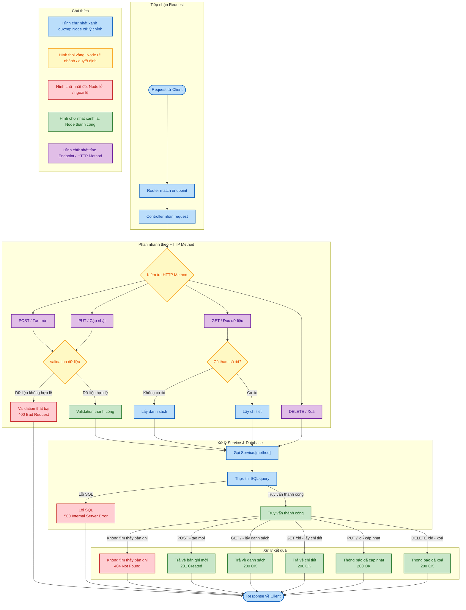

# TKWedNC-CK

Hệ thống quản lý tuyển dụng (Job Recruitment Management) - REST API với Node.js, Express và MySQL (Aiven).

## Kiến trúc Module

Mỗi module (Auth, Jobs, Applications, Candidates, Users) đều tuân theo cùng một kiến trúc chuẩn:

```
src/{module}/
├── {module}Module.js       // Đăng ký routes vào app
├── {module}Controller.js   // Xử lý HTTP request/response
├── {module}Service.js      // Logic nghiệp vụ + truy vấn DB
├── {module}Entity.js       // Validation & normalize dữ liệu
└── {module}Middleware.js   // (Auth) Middleware kiểm tra session/quyền
```

### Danh sách Module

| Module | Đường dẫn | Chức năng |
|--------|-----------|-----------|
| Auth | `src/auth/` | Xác thực & phân quyền (register, login, logout) |
| Jobs | `src/jobs/` | Quản lý công việc / tin tuyển dụng |
| Applications | `src/applications/` | Quản lý đơn ứng tuyển |
| Candidates | `src/candidates/` | Quản lý hồ sơ ứng viên |
| Users | `src/user/` | Quản lý tài khoản người dùng |

## Lưu đồ thuật toán CRUD (Flowchart)



## Authentication

Hệ thống sử dụng **session-based authentication** với `express-session` và `cookie-parser`.

### API Endpoints

| Method | Endpoint | Mô tả | 
|--------|----------|-------|
| `POST` | `/auth/register` | Đăng ký tài khoản mới |
| `POST` | `/auth/login` | Đăng nhập |
| `POST` | `/auth/logout` | Đăng xuất |
| `GET` | `/auth/me` | Lấy thông tin user hiện tại |
| `POST` | `/jobs` | Tạo job mới |
| `GET` | `/jobs` | Lấy danh sách jobs |
| `GET` | `/jobs/:id` | Lấy job theo ID |
| `PUT` | `/jobs/:id` | Cập nhật job |
| `DELETE` | `/jobs/:id` | Xoá job |
| `POST` | `/applications` | Tạo application mới |
| `GET` | `/applications` | Lấy danh sách applications |
| `GET` | `/applications/:id` | Lấy application theo ID |
| `PUT` | `/applications/:id` | Cập nhật application |
| `DELETE` | `/applications/:id` | Xoá application |
| `POST` | `/candidates` | Tạo candidate mới |
| `GET` | `/candidates` | Lấy danh sách candidates |
| `GET` | `/candidates/:id` | Lấy candidate theo ID |
| `PUT` | `/candidates/:id` | Cập nhật candidate |
| `DELETE` | `/candidates/:id` | Xoá candidate |
| `POST` | `/users` | Tạo user mới |
| `GET` | `/users` | Lấy danh sách users |
| `GET` | `/users/:id` | Lấy user theo ID |
| `PUT` | `/users/:id` | Cập nhật user |
| `DELETE` | `/users/:id` | Xoá user |

> **Lưu ý:** Sau khi đăng ký hoặc đăng nhập thành công, server sẽ set session cookie. Cookie này cần được gửi kèm trong các request tới protected endpoints.

## Cách chạy

```bash
# Cài dependencies
npm install

# Cấu hình database (tạo file .env)
# DB_PASSWORD=your_password_here

# Khởi động server
npm run dev
```
