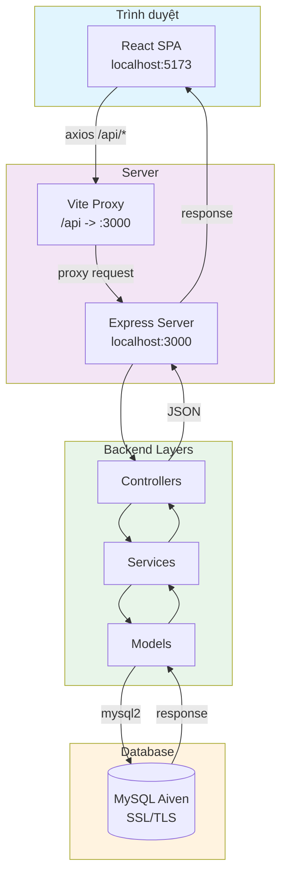
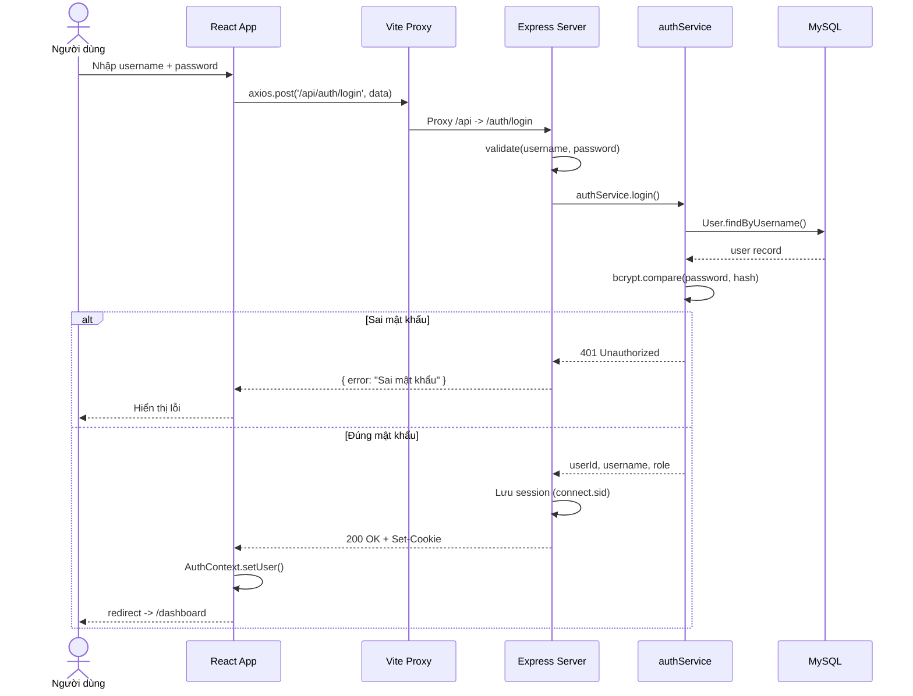
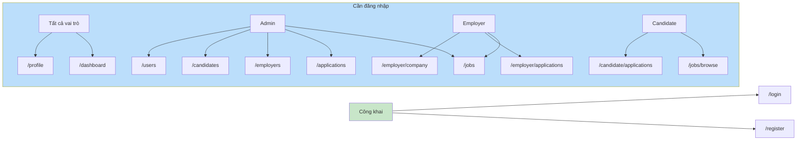
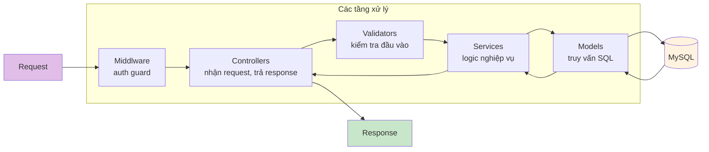
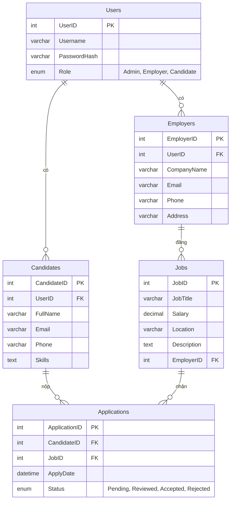
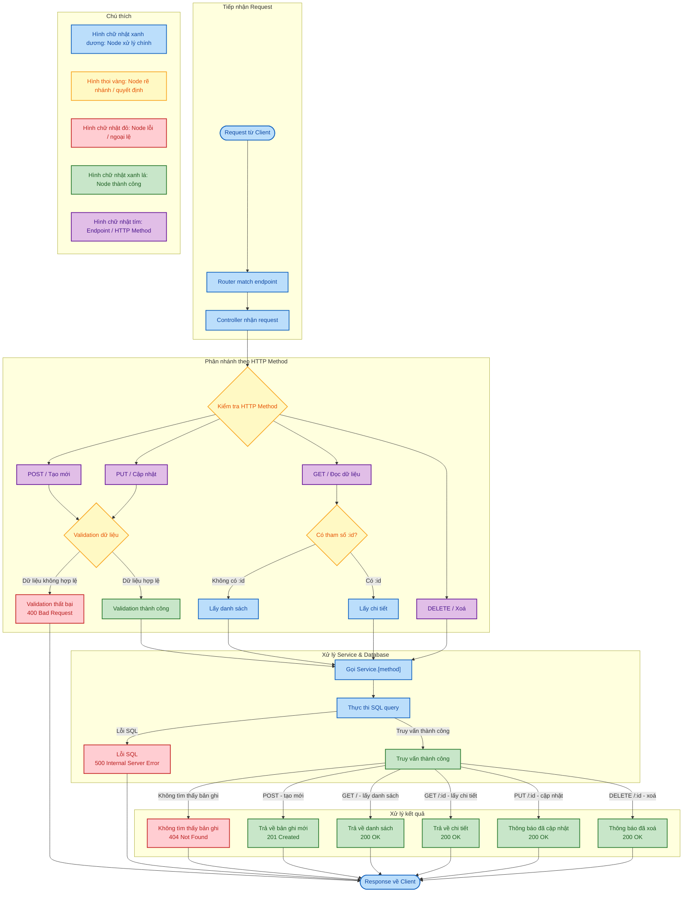

# TKWedNC-CK

Hệ thống quản lý tuyển dụng (Job Recruitment Management) - Monorepo với **REST API (Node.js/Express 5)** + **Frontend SPA (React/Vite)**, kết nối **MySQL (Aiven)** qua SSL/TLS.

---

## Kiến trúc tổng thể


```mermaid
graph TB
    subgraph Client["Trình duyệt"]
        REACT[React SPA<br/>localhost:5173]
    end

    subgraph Server["Server"]
        VITE[Vite Proxy<br/>/api -> :3000]
        EXPRESS[Express Server<br/>localhost:3000]
    end

    subgraph Backend["Backend Layers"]
        CTRL[Controllers]
        SVC[Services]
        MDL[Models]
    end

    subgraph DB["Database"]
        MYSQL[(MySQL Aiven<br/>SSL/TLS)]
    end

    REACT -->|axios /api/*| VITE
    VITE -->|proxy request| EXPRESS
    EXPRESS --> CTRL
    CTRL --> SVC
    SVC --> MDL
    MDL -->|mysql2| MYSQL
    MYSQL -->|response| MDL
    MDL --> SVC
    SVC --> CTRL
    CTRL -->|JSON| EXPRESS
    EXPRESS -->|response| REACT

    style Client fill:#e1f5fe
    style Server fill:#f3e5f5
    style Backend fill:#e8f5e9
    style DB fill:#fff3e0
```

---

## Cấu trúc thư mục

```
TKWedNC-CK/
├── backend/                        # REST API
│   ├── server.js                   # Entry point
│   ├── package.json
│   └── src/
│       ├── config/
│       │   ├── database.js         # Kết nối MySQL (SSL nếu có ca.pem)
│       │   └── ca.pem              # Chứng chỉ SSL Aiven
│       ├── controllers/            # Route handlers
│       │   ├── auth.js
│       │   ├── employer.js
│       │   ├── job.js
│       │   ├── application.js
│       │   ├── candidate.js
│       │   └── user.js
│       ├── services/               # Logic nghiệp vụ
│       │   ├── auth.js
│       │   ├── employer.js
│       │   ├── job.js
│       │   ├── application.js
│       │   ├── candidate.js
│       │   └── user.js
│       ├── models/                 # Truy vấn SQL (callback-based)
│       │   ├── User.js
│       │   ├── Employer.js
│       │   ├── Job.js
│       │   ├── Application.js
│       │   └── Candidate.js
│       ├── validators/             # Validation + normalize đầu vào
│       │   ├── auth.js
│       │   ├── user.js
│       │   ├── employer.js
│       │   ├── job.js
│       │   ├── application.js
│       │   └── candidate.js
│       └── middleware/
│           └── auth.js             # requireAuth, requireRole
│
├── frontend/                       # React SPA
│   ├── index.html
│   ├── vite.config.js
│   ├── package.json
│   └── src/
│       ├── main.jsx                # Entry point
│       ├── App.jsx                 # Router + Routes
│       ├── index.css               # Global styles (~1980 dòng)
│       ├── api/
│       │   └── axios.js            # Axios instance (proxy /api -> backend)
│       ├── context/
│       │   └── AuthContext.jsx     # Quản lý auth state
│       ├── components/
│       │   ├── Layout.jsx
│       │   ├── Sidebar.jsx
│       │   ├── ProtectedRoute.jsx
│       │   └── Toast.jsx
│       └── pages/
│           ├── Login.jsx
│           ├── Register.jsx
│           ├── Dashboard.jsx
│           ├── Profile.jsx
│           ├── Jobs.jsx
│           ├── JobForm.jsx
│           ├── JobDetail.jsx
│           ├── BrowseJobs.jsx
│           ├── Applications.jsx
│           ├── MyApplications.jsx
│           ├── EmployerApplications.jsx
│           ├── Employers.jsx
│           ├── Candidates.jsx
│           ├── Users.jsx
│           └── CompanyProfile.jsx
│
├── .env.example
├── package.json                    # Root: concurrently -> backend + frontend
└── README.md
```

---

## Công nghệ sử dụng

### Backend

| Package | Version | Mục đích |
|---------|---------|----------|
| Node.js | - | Runtime |
| Express | ^5.2.1 | Web framework |
| mysql2 | ^3.22.5 | MySQL driver (SSL/TLS) |
| express-session | ^1.19.0 | Session-based auth |
| bcrypt | ^6.0.0 | Mã hoá mật khẩu |
| cookie-parser | ^1.4.7 | Parse & sign cookies |
| dotenv | ^17.4.2 | Biến môi trường |

### Frontend

| Package | Version | Mục đích |
|---------|---------|----------|
| React | ^19.2.7 | UI library |
| Vite | ^8.1.1 | Build tool & dev server |
| react-router-dom | ^7.18.1 | Client-side routing |
| axios | ^1.18.1 | HTTP client |
| dotenv | ^17.4.2 | Biến môi trường |

---

## Authentication

Hệ thống dùng **session-based authentication** (`express-session` + `cookie-parser`).

- **`requireAuth`**: Kiểm tra `req.session.userId` -> 401 nếu chưa đăng nhập.
- **`requireRole(...roles)`**: Kiểm tra `req.session.role` -> 403 nếu không có quyền.

Vai trò: `Admin` | `Employer` | `Candidate`

### Luồng đăng nhập


```mermaid
sequenceDiagram
    actor User as Người dùng
    participant React as React App
    participant Vite as Vite Proxy
    participant Express as Express Server
    participant Auth as authService
    participant DB as MySQL

    User->>React: Nhập username + password
    React->>Vite: axios.post('/api/auth/login', data)
    Vite->>Express: Proxy /api -> /auth/login
    Express->>Express: validate(username, password)
    Express->>Auth: authService.login()
    Auth->>DB: User.findByUsername()
    DB-->>Auth: user record
    Auth->>Auth: bcrypt.compare(password, hash)
    alt Sai mật khẩu
        Auth-->>Express: 401 Unauthorized
        Express-->>React: { error: "Sai mật khẩu" }
        React-->>User: Hiển thị lỗi
    else Đúng mật khẩu
        Auth-->>Express: userId, username, role
        Express->>Express: Lưu session (connect.sid)
        Express-->>React: 200 OK + Set-Cookie
        React->>React: AuthContext.setUser()
        React-->>User: redirect -> /dashboard
    end
```

---

## Frontend Routes


```mermaid
graph LR
    Public["Công khai"] --> Login["/login"]
    Public --> Register["/register"]

    subgraph Protected["Cần đăng nhập"]
        Chung["Tất cả vai trò"] --> Dash["/dashboard"]
        Chung --> Profile["/profile"]

        Admin["Admin"] --> Jobs["/jobs"]
        Admin --> Apps["/applications"]
        Admin --> Emp["/employers"]
        Admin --> Cand["/candidates"]
        Admin --> Users["/users"]

        Employer["Employer"] --> Jobs
        Employer --> EmpApps["/employer/applications"]
        Employer --> Company["/employer/company"]

        Candidate["Candidate"] --> Browse["/jobs/browse"]
        Candidate --> MyApps["/candidate/applications"]
    end

    style Public fill:#c8e6c9
    style Protected fill:#bbdefb
```

| Path | Trang | Vai trò |
|------|-------|---------|
| `/login` | Đăng nhập | Public |
| `/register` | Đăng ký | Public |
| `/dashboard` | Tổng quan | Chung |
| `/profile` | Hồ sơ cá nhân | Chung |
| `/jobs` | Quản lý tin tuyển dụng | Admin / Employer |
| `/jobs/new` | Đăng tin mới | Admin / Employer |
| `/jobs/:id/edit` | Sửa tin | Admin / Employer |
| `/jobs/browse` | Duyệt việc làm | Candidate |
| `/jobs/:id` | Chi tiết việc làm | Chung |
| `/applications` | Quản lý đơn ứng tuyển | Admin |
| `/candidate/applications` | Đơn đã nộp | Candidate |
| `/employer/applications` | Đơn nhận được | Employer |
| `/employers` | Quản lý doanh nghiệp | Admin |
| `/candidates` | Quản lý ứng viên | Admin |
| `/users` | Quản lý tài khoản | Admin |
| `/employer/company` | Hồ sơ công ty | Employer |

---

## Kiến trúc Backend (Layer-based)

Dự án tổ chức theo **tầng (layer)** - mỗi tầng có trách nhiệm riêng, request đi qua lần lượt các tầng:


```mermaid
graph LR
    subgraph Layers["Các tầng xử lý"]
        direction TB
        MW[Middlware<br/>auth guard] --> CTRL[Controllers<br/>nhận request, trả response]
        CTRL --> VALID[Validators<br/>kiểm tra đầu vào]
        VALID --> SVC[Services<br/>logic nghiệp vụ]
        SVC --> MDL[Models<br/>truy vấn SQL]
    end

    REQ[Request] --> MW
    MDL --> MYSQL[(MySQL)]
    MYSQL --> MDL
    MDL --> SVC
    SVC --> CTRL
    CTRL --> RES[Response]

    style REQ fill:#e1bee7
    style RES fill:#c8e6c9
    style MYSQL fill:#fff3e0
```

### Luồng xử lý request

```
Request -> Router -> Middleware -> Controller -> Validator -> Service -> Model -> MySQL
                                |                                              |
                                +--> 401/403 nếu không có quyền                |
                                                                               v
                                                                    Response <- <- <-
```

---

## Cơ sở dữ liệu

### Sơ đồ quan hệ (ERD)


```mermaid
erDiagram
    Users ||--o{ Employers : "có"
    Users ||--o{ Candidates : "có"
    Employers ||--o{ Jobs : "đăng"
    Candidates ||--o{ Applications : "nộp"
    Jobs ||--o{ Applications : "nhận"

    Users {
        int UserID PK
        varchar Username
        varchar PasswordHash
        enum Role "Admin, Employer, Candidate"
    }

    Employers {
        int EmployerID PK
        int UserID FK
        varchar CompanyName
        varchar Email
        varchar Phone
        varchar Address
    }

    Jobs {
        int JobID PK
        varchar JobTitle
        decimal Salary
        varchar Location
        text Description
        int EmployerID FK
    }

    Candidates {
        int CandidateID PK
        int UserID FK
        varchar FullName
        varchar Email
        varchar Phone
        text Skills
    }

    Applications {
        int ApplicationID PK
        int CandidateID FK
        int JobID FK
        datetime ApplyDate
        enum Status "Pending, Reviewed, Accepted, Rejected"
    }
```

### Các bảng

| Bảng | Mục đích | Cột chính |
|------|----------|-----------|
| `Users` | Tài khoản | UserID, Username, PasswordHash, Role |
| `Employers` | Doanh nghiệp | EmployerID, UserID, CompanyName, Email, Phone, Address |
| `Jobs` | Tin tuyển dụng | JobID, JobTitle, Salary, Location, Description, EmployerID |
| `Candidates` | Ứng viên | CandidateID, UserID, FullName, Email, Phone, Skills |
| `Applications` | Đơn ứng tuyển | ApplicationID, CandidateID, JobID, ApplyDate, Status |

---

## Lưu đồ CRUD


```mermaid
flowchart TD
    classDef process fill:#bbdefb,stroke:#1565c0,stroke-width:2px,color:#0d47a1;
    classDef decision fill:#fff9c4,stroke:#f9a825,stroke-width:2px,color:#e65100;
    classDef error fill:#ffcdd2,stroke:#c62828,stroke-width:2px,color:#b71c1c;
    classDef success fill:#c8e6c9,stroke:#2e7d32,stroke-width:2px,color:#1b5e20;
    classDef endpoint fill:#e1bee7,stroke:#6a1b9a,stroke-width:2px,color:#4a148c;

    subgraph TIEP_NHAN["Tiếp nhận Request"]
        START(["Request từ Client"]):::process
        ROUTER["Router match endpoint"]:::process
        CONTROLLER["Controller nhận request"]:::process
    end

    subgraph PHAN_NHANH["Phân nhánh theo HTTP Method"]
        CHK_METHOD{"Kiểm tra HTTP Method"}:::decision

        POST_BRANCH["POST / Tạo mới"]:::endpoint
        PUT_BRANCH["PUT / Cập nhật"]:::endpoint

        VALIDATE{"Validation dữ liệu"}:::decision
        VALID_FAIL["Validation thất bại\n400 Bad Request"]:::error
        VALID_OK["Validation thành công"]:::success

        GET_BRANCH["GET / Đọc dữ liệu"]:::endpoint
        CHK_ID{"Có tham số :id?"}:::decision
        GET_LIST["Lấy danh sách"]:::process
        GET_ONE["Lấy chi tiết"]:::process

        DELETE_BRANCH["DELETE / Xoá"]:::endpoint
    end

    subgraph SERVICE_DB["Xử lý Service & Database"]
        SERVICE["Gọi Service.[method]"]:::process
        DB_QUERY["Thực thi SQL query"]:::process
        DB_ERR["Lỗi SQL\n500 Internal Server Error"]:::error
        DB_OK["Truy vấn thành công"]:::success
    end

    subgraph KET_QUA["Xử lý kết quả"]
        NOT_FOUND["Không tìm thấy bản ghi\n404 Not Found"]:::error
        RETURN_CREATED["Trả về bản ghi mới\n201 Created"]:::success
        RETURN_LIST["Trả về danh sách\n200 OK"]:::success
        RETURN_ONE["Trả về chi tiết\n200 OK"]:::success
        RETURN_UPDATED["Thông báo đã cập nhật\n200 OK"]:::success
        RETURN_DELETED["Thông báo đã xoá\n200 OK"]:::success
    end

    END_RESPONSE(["Response về Client"]):::process

    START --> ROUTER --> CONTROLLER
    CONTROLLER --> CHK_METHOD

    CHK_METHOD --> POST_BRANCH
    CHK_METHOD --> PUT_BRANCH
    POST_BRANCH --> VALIDATE
    PUT_BRANCH --> VALIDATE
    VALIDATE -->|"Dữ liệu không hợp lệ"| VALID_FAIL
    VALIDATE -->|"Dữ liệu hợp lệ"| VALID_OK
    VALID_FAIL --> END_RESPONSE

    CHK_METHOD --> GET_BRANCH
    GET_BRANCH --> CHK_ID
    CHK_ID -->|"Không có :id"| GET_LIST
    CHK_ID -->|"Có :id"| GET_ONE

    CHK_METHOD --> DELETE_BRANCH

    VALID_OK --> SERVICE
    GET_LIST --> SERVICE
    GET_ONE --> SERVICE
    DELETE_BRANCH --> SERVICE

    SERVICE --> DB_QUERY

    DB_QUERY -->|"Lỗi SQL"| DB_ERR
    DB_QUERY -->|"Truy vấn thành công"| DB_OK

    DB_ERR --> END_RESPONSE

    DB_OK -->|"Không tìm thấy bản ghi"| NOT_FOUND
    DB_OK -->|"POST - tạo mới"| RETURN_CREATED
    DB_OK -->|"GET / - lấy danh sách"| RETURN_LIST
    DB_OK -->|"GET /:id - lấy chi tiết"| RETURN_ONE
    DB_OK -->|"PUT /:id - cập nhật"| RETURN_UPDATED
    DB_OK -->|"DELETE /:id - xoá"| RETURN_DELETED

    NOT_FOUND --> END_RESPONSE
    RETURN_CREATED --> END_RESPONSE
    RETURN_LIST --> END_RESPONSE
    RETURN_ONE --> END_RESPONSE
    RETURN_UPDATED --> END_RESPONSE
    RETURN_DELETED --> END_RESPONSE

    subgraph LEGEND["Chú thích"]
        L1["Hình chữ nhật xanh dương: Node xử lý chính"]:::process
        L2["Hình thoi vàng: Node rẽ nhánh / quyết định"]:::decision
        L3["Hình chữ nhật đỏ: Node lỗi / ngoại lệ"]:::error
        L4["Hình chữ nhật xanh lá: Node thành công"]:::success
        L5["Hình chữ nhật tím: Endpoint / HTTP Method"]:::endpoint
    end
```

---

## API Endpoints

> Gọi từ frontend: `axios.post('/api/auth/login', ...)` -> Vite proxy -> `http://localhost:3000/auth/login`  
> Các endpoint trừ `/auth/register` và `/auth/login` đều yêu cầu **session cookie**.

| Method | Endpoint | Auth | Mô tả |
|--------|----------|------|-------|
| POST | `/auth/register` | - | Đăng ký |
| POST | `/auth/login` | - | Đăng nhập |
| POST | `/auth/logout` | Có | Đăng xuất |
| GET | `/auth/me` | Có | Thông tin user hiện tại |
| POST | `/employers` | Có | Tạo doanh nghiệp |
| GET | `/employers` | Có | Danh sách doanh nghiệp |
| GET | `/employers/:id` | Có | Chi tiết doanh nghiệp |
| PUT | `/employers/:id` | Có | Cập nhật doanh nghiệp |
| DELETE | `/employers/:id` | Có | Xoá doanh nghiệp |
| POST | `/jobs` | Có | Tạo tin tuyển dụng |
| GET | `/jobs` | Có | Danh sách tin |
| GET | `/jobs/:id` | Có | Chi tiết tin |
| PUT | `/jobs/:id` | Có | Cập nhật tin |
| DELETE | `/jobs/:id` | Có | Xoá tin |
| POST | `/applications` | Có | Nộp đơn |
| GET | `/applications` | Có | Danh sách đơn |
| GET | `/applications/:id` | Có | Chi tiết đơn |
| PUT | `/applications/:id` | Có | Cập nhật đơn |
| DELETE | `/applications/:id` | Có | Xoá đơn |
| POST | `/candidates` | Có | Tạo hồ sơ ứng viên |
| GET | `/candidates` | Có | Danh sách ứng viên |
| GET | `/candidates/:id` | Có | Chi tiết ứng viên |
| PUT | `/candidates/:id` | Có | Cập nhật ứng viên |
| DELETE | `/candidates/:id` | Có | Xoá ứng viên |
| POST | `/users` | Có | Tạo tài khoản |
| GET | `/users` | Có | Danh sách tài khoản |
| GET | `/users/:id` | Có | Chi tiết tài khoản |
| PUT | `/users/:id` | Có | Cập nhật tài khoản |
| DELETE | `/users/:id` | Có | Xoá tài khoản |

### Route utility (public)

| Method | Endpoint | Mô tả |
|--------|----------|-------|
| GET | `/visits` | Đếm số truy cập (demo session) |
| GET | `/set-cookie` | Set signed cookie |
| GET | `/read-cookie` | Đọc cookie + signed cookie |

> Cookie `connect.sid` được axios gửi tự động nhờ `withCredentials: true`.

---

## Cấu hình môi trường

Tạo file `.env` tại thư mục **gốc** project:

```env
SESSION_KEY=your_session_key_here
COOKIE_SECRET=your_cookie_secret_here

FRONTEND_PORT=5173
BACKEND_PORT=3000

DB_HOST=your_database_host
DB_PORT=your_database_port
DB_USER=avnadmin
DB_NAME=JOBRECRUITMENT
DB_PASSWORD=your_database_password_here
```

| Biến | Bắt buộc | Mặc định | Mô tả |
|------|----------|----------|-------|
| `SESSION_KEY` | Có | - | Secret cho express-session |
| `COOKIE_SECRET` | Có | - | Secret cho signed cookies |
| `FRONTEND_PORT` | Không | `5173` | Cổng Vite dev server |
| `BACKEND_PORT` | Không | `3000` | Cổng Express server |
| `DB_HOST` | Có | - | Host MySQL Aiven |
| `DB_PORT` | Có | - | Port MySQL Aiven |
| `DB_USER` | Có | `avnadmin` | User database |
| `DB_NAME` | Có | `JOBRECRUITMENT` | Tên database |
| `DB_PASSWORD` | Có | - | Mật khẩu database |

> File `backend/src/config/ca.pem` là **tuỳ chọn**. Nếu có, connection sẽ dùng SSL/TLS.  
> Nếu không có file, server sẽ thử kết nối không SSL -- nếu server yêu cầu SSL, sẽ báo lỗi "Không tìm thấy file ca.pem".

---

## Hướng dẫn chạy

```bash
# 1. Cài tất cả dependencies
npm install
cd backend && npm install && cd ..
cd frontend && npm install && cd ..

# 2. Tạo file .env
cp .env.example .env
# điền các thông số phù hợp

# 3. Khởi động cả backend lẫn frontend
npm run dev
```

Sau đó:
- **Frontend**: http://localhost:5173
- **Backend**: http://localhost:3000

### Chạy riêng từng phần

```bash
# Chỉ backend
npm run dev --prefix backend

# Chỉ frontend
npm run dev --prefix frontend
```

---

## Thử nghiệm với curl

```bash
# Đăng ký
curl -X POST http://localhost:3000/auth/register \
  -H "Content-Type: application/json" \
  -d '{"username":"test1","password":"123456","role":"Candidate"}'

# Đăng nhập
curl -X POST http://localhost:3000/auth/login \
  -H "Content-Type: application/json" \
  -d '{"username":"test1","password":"123456"}'

# Tạo doanh nghiệp
curl -X POST http://localhost:3000/employers \
  -H "Content-Type: application/json" \
  -d '{"companyName":"Acme Corp","email":"acme@example.com","phone":"0123456789","address":"HCMC"}'

# Tạo tin tuyển dụng
curl -X POST http://localhost:3000/jobs \
  -H "Content-Type: application/json" \
  -d '{"title":"Backend Developer","employerId":1,"location":"Remote","salary":"2500","description":"Node.js role"}'

# Tạo ứng viên
curl -X POST http://localhost:3000/candidates \
  -H "Content-Type: application/json" \
  -d '{"fullName":"John Doe","email":"john@example.com","phone":"0987654321","skills":"Node.js, MySQL"}'

# Nộp đơn ứng tuyển
curl -X POST http://localhost:3000/applications \
  -H "Content-Type: application/json" \
  -d '{"candidateId":1,"jobId":1,"status":"Pending"}'
```

> Trường `status` mặc định là `"Pending"` nếu không truyền.
